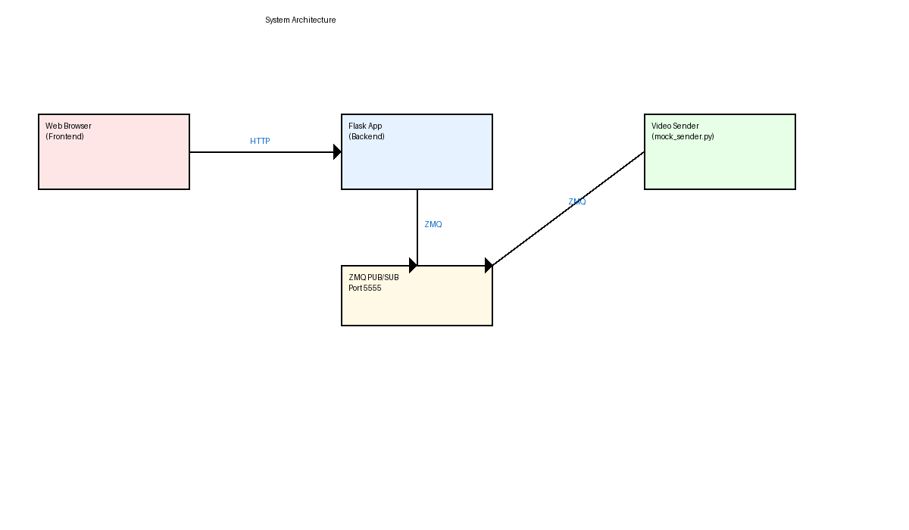
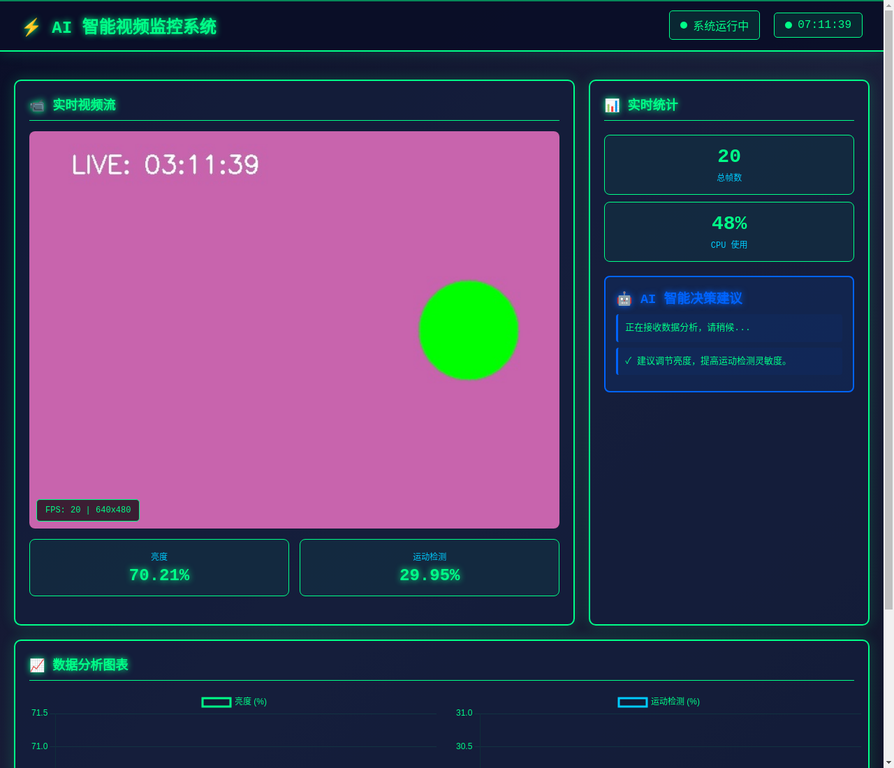
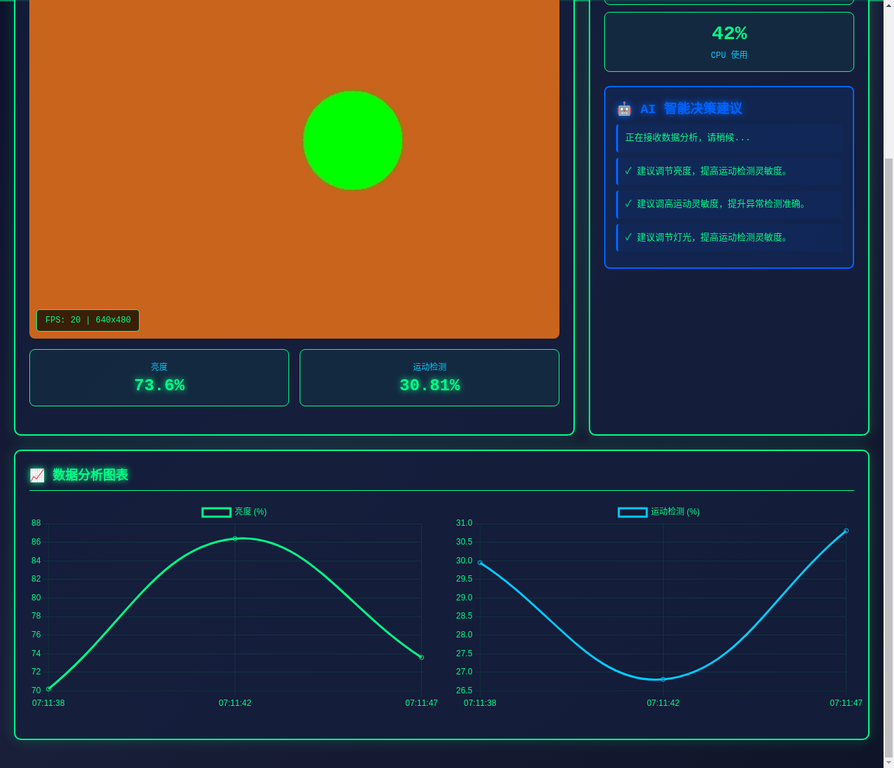

# bigchuang - AI 智能视频监控系统

## 1. 项目简介

`bigchuang` 是一个基于 Python Flask 框架和 OpenCV 库实现的 AI 智能视频监控系统。它通过 ZeroMQ (ZMQ) 进行视频帧的实时传输，并在一个具有现代科技感的前端界面上展示。该系统集成了实时数据可视化、AI 数据分析模块，并能利用大模型对视频流数据进行分析并给出智能决策建议。

## 2. 功能特性

*   **实时视频流**：通过科技感十足的网页界面实时显示视频画面。
*   **实时数据可视化**：集成 Chart.js，动态展示视频流的亮度、运动检测等关键指标。
*   **AI 数据分析**：后端模拟对视频帧进行特征提取和分析，为决策提供数据支持。
*   **智能决策建议**：利用大模型（OpenAI API）根据实时分析数据生成专业的监控建议。
*   **模块化设计**：Flask 负责 Web 服务和 API 接口，ZMQ 负责高效数据传输。
*   **易于扩展**：可在此基础上集成更复杂的 AI 模型（如目标识别、行为分析）和更多数据源。

## 3. 环境要求

### 3.1 操作系统

*   **推荐**：Ubuntu 20.04+ 或其他 Linux 发行版。
*   **支持**：Windows (可能需要注意 OpenCV 摄像头驱动兼容性)。

### 3.2 Python 版本

*   Python 3.8 及以上版本。

### 3.3 Python 依赖

项目所需的所有 Python 依赖都列在 `requirements.txt` 文件中。您可以使用 `pip` 进行安装：

```bash
pip install -r requirements.txt
```

具体依赖包括：
*   `Flask`：Web 框架。
*   `opencv-python`：OpenCV 库的 Python 绑定，用于视频处理。
*   `pyzmq`：ZeroMQ 消息队列的 Python 绑定，用于帧传输。
*   `numpy`：用于处理图像数据。
*   `openai`：用于调用 OpenAI API 获取 AI 决策建议。

## 4. 硬件设备

*   **摄像头**：一个可用的 USB 摄像头或 IP 摄像头（如果使用 IP 摄像头，需要修改 `mock_sender.py` 中的 `cv2.VideoCapture()` 参数）。
*   **计算资源**：由于涉及视频处理、传输和 AI 推理，建议使用性能较好的 CPU 和足够的内存。如果需要进行复杂的 AI 模型推理，可能需要 GPU 支持。

## 5. 安装与启动

请按照以下步骤安装和启动项目：

### 5.1 克隆仓库

首先，将项目仓库克隆到本地：

```bash
git clone https://github.com/Zhu-TianYu/bigchuang.git
cd bigchuang
```

### 5.2 安装依赖

进入项目目录后，安装所有必要的 Python 依赖：

```bash
pip install -r requirements.txt
```

### 5.3 启动视频流发送端

**重要：请务必先启动发送端！**

启动 `mock_sender.py` 脚本，它将作为 ZMQ 发布者在 `tcp://*:5555` 端口上绑定并发送模拟视频帧：

```bash
python3 mock_sender.py
```

如果您有真实的摄像头，并且希望使用它作为视频源，您需要修改 `mock_sender.py` 来从摄像头捕获帧并发送。

### 5.4 启动 Flask 应用

在视频流发送端成功启动后，在项目根目录下运行 `app.py` 启动 Flask Web 服务。这将启动一个在 `http://0.0.0.0:5000` 监听的服务器，并连接到 ZMQ 视频流，同时提供 AI 建议 API：

```bash
python3 app.py
```

### 5.5 访问系统界面

在 Flask 应用和视频流发送端都成功启动后，您可以通过浏览器访问以下地址查看实时视频流、数据可视化和 AI 智能建议：

```
http://localhost:5000/
```

## 6. 初次使用配置

### 6.1 ZMQ 端口配置

`app.py` 和 `mock_sender.py` 之间通过 ZMQ 进行通信。默认端口为 `5555`。

*   在 `mock_sender.py` 中，`footage_socket.bind("tcp://*:5555")` 表示发送端在 `5555` 端口上等待连接。
*   在 `app.py` 中，`footage_socket.connect("tcp://127.0.0.1:5555")` 表示 Flask 应用连接到 `localhost` 的 `5555` 端口。

如果您需要更改端口，请确保 `app.py` 和发送端脚本中的端口号保持一致。

### 6.2 OpenAI API Key 配置

`app.py` 中的 AI 决策模块需要调用 OpenAI API。在 Manus 环境中，`OPENAI_API_KEY` 已预配置。如果您在其他环境中运行，请确保您的环境变量中设置了 `OPENAI_API_KEY`，或者在 `app.py` 中手动配置。

## 7. 项目结构

```
bigchuang/
├── app.py                  # Flask 主应用文件，处理 Web 请求、视频流接收和 AI 建议 API
├── mock_sender.py          # 模拟视频流发送端，用于测试
├── requirements.txt        # Python 依赖列表
├── templates/              # HTML 模板文件
│   └── index.html          # 科技感视频流显示页面，集成数据可视化和 AI 建议
├── static/                 # 静态资源文件 (CSS, JS, 图片等)
├── screenshots/            # 项目运行截图
└── modules/                # 其他模块 (如果存在)
```

## 8. 运行成果展示

### 8.1 系统架构图

下图展示了本项目的系统架构，包括 Web 浏览器、Flask 应用、ZMQ 通信以及视频发送端之间的关系。



### 8.2 系统启动步骤

下图详细说明了如何启动本项目的各个组件。


### 8.3 升级后的前端界面

以下是项目升级后的前端界面截图，展示了科技感十足的 UI 设计、实时视频流、数据面板、AI 智能决策建议以及数据分析图表。



### 8.4 实时数据可视化与 AI 建议

前端界面集成了 Chart.js，动态展示视频流的亮度、运动检测等关键指标。AI 智能决策建议也会实时更新。



## 9. 故障排除

*   **`ModuleNotFoundError`**：确保所有依赖都已通过 `pip install -r requirements.txt` 安装。
*   **端口占用**：如果 Flask 启动失败并提示端口 `5000` 被占用，请检查是否有其他程序正在使用该端口，或者修改 `app.py` 中的 `app.run(port=...)` 来使用其他端口。
*   **视频流无画面**：
    *   确保 `mock_sender.py` 和 `app.py` 都已成功启动，并且**发送端先于 Flask 应用启动**。
    *   检查 ZMQ 端口配置是否一致。
    *   如果使用真实摄像头，请确保摄像头驱动正常，并且 `mock_sender.py` 中的 `cv2.VideoCapture()` 参数正确。
*   **`zmq.Again` 错误**：这通常表示 ZMQ 接收端在设定的超时时间内没有收到消息。请确保发送端正在正常发送数据。
*   **AI 建议未更新**：检查 `OPENAI_API_KEY` 是否正确配置，并确保网络连接正常。

## 10. 许可证

[在此处添加您的许可证信息，例如 MIT License 或 Apache License 2.0]
